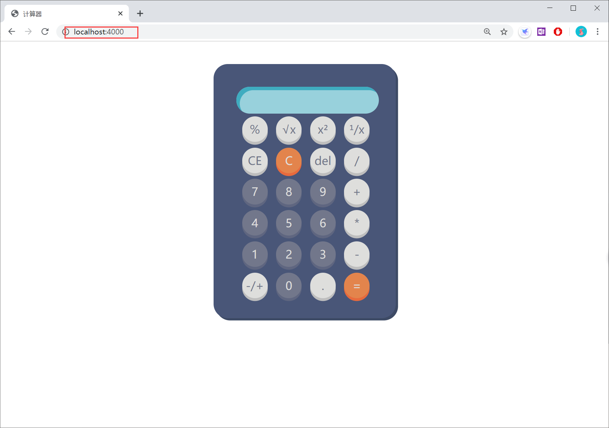

# 使用GO语言搭建简易计算器

KEY WORD: CS模式 中缀表达 后缀表达  
## 主要功能
使用CS模式,前端进行页面展示.后端进行计算返回值
实现了加减乘除多则运算功能 前后端发送功能


## 项目设计
```
-->Web前端
	|-->界面设计
		|-->计算式的输入
	|-->输入判断（只能输入合规的符号或者数字）
-->基于GO语言的后端
	|-->接收请求
		|-->将中缀表达式变为后缀表达式
		|-->对后缀表达式进行计算
		|-->得出结果
	|-->响应请求（发回结果）

----------------------------------------------------------------------------
-->main.go
   |-->sayHello1       主页          
   |-->index           发送HTML
   |-->calculate       计算
   |-->infixTOPostfix  将中缀表达式变为后缀表达式
   |-->isLower         将中缀表达式变为后缀表达式
   |-->main			  主函数
-->stack.go
   |-->New()      创建栈
   |-->Push()     入栈
   |-->Pop()      出栈
   |-->Top()      取栈顶
   |-->IsEmpty()  判空
```
## 项目实现剪影




实现开方，倒数，开根号


